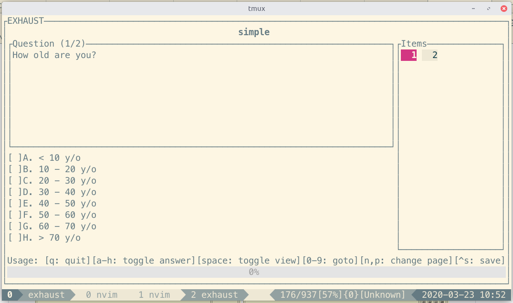

# Exhaust
= Exam + Rust

A terminal app for doing exams, powered with tui-rs.



## Schema
Here is the json schema that exam files use

```typescript
type RootType = {
  questions: QuestionType[],
}

type QuestionType = {
  type: "Question",
  question: string,
  selections: SelectionType[],
  answer: string?,
  user_selection: SelectionMaskType,
  assets: string[]?,
  [key: string]: any,
}

type SelectionMaskType = number;

```
